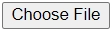
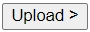
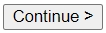
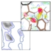
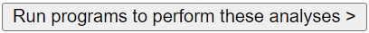
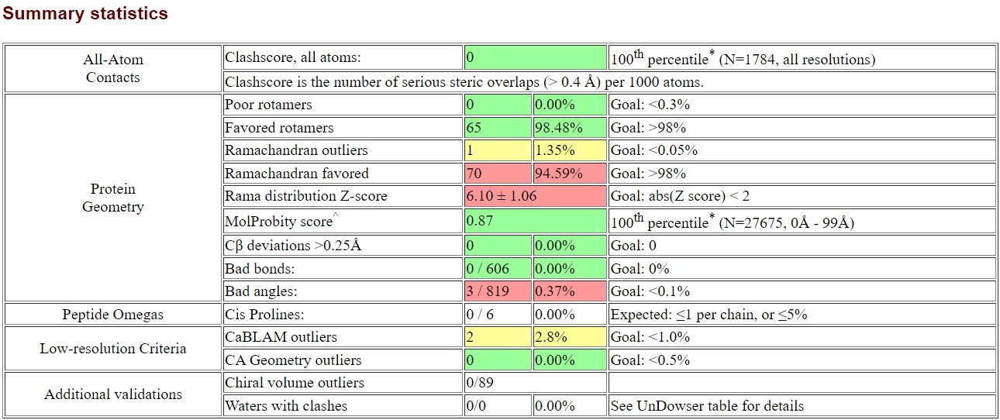

## Protein Tertiary Structure Validation using MolProbity

Steps:
1. Open [MolProbity Server](http://molprobity.biochem.duke.edu/).
2. Upload the protein PDB file by click , find and choose your file then click .
3. Wait until the PDB file succesfully uploaded, click .
4. In **Currently working on:** dropdown menu, change the option to **File (modified) uploaded by user** (not the <u>**trimmed**</u> one, click <u>Analyze all-atom contacts and geometry</u>.
5. Choose the necessary analysis or keep it default and scroll to the end of the site, click .
6. Wait until the job is finished and the page show the analysis output as shown below.

To download the Ramachandran Plot as PDF file: click <u>View</u> besides **Ramachandran plot PDF**.
