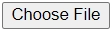

# Protein Structure Refinement

## Refinement using GalaxyRefine method.

Steps:
1. Open [GalaxyRefine](https://galaxy.seoklab.org/cgi-bin/submit.cgi?type=REFINE) website.
2. Fill **Jobs name** and **E-mail address** (so you will be notified by e-mail once the job is finished).
3. Upload the protein PDB file by click , find and choose your file then click submit.
4. Click the LINK besided REPORT and wait until it finished.

## Refinement using GalaxyRefine2 method.

Steps:
1. Open [GalaxyRefine2](https://galaxy.seoklab.org/cgi-bin/submit.cgi?type=REFINE2) website.
2. Fill **Jobs name** and **E-mail address** (so you will be notified by e-mail once the job is finished).
3. Upload the protein PDB file by click , find and choose your file then click submit.
4. Click the LINK besided REPORT and wait until it finished.
